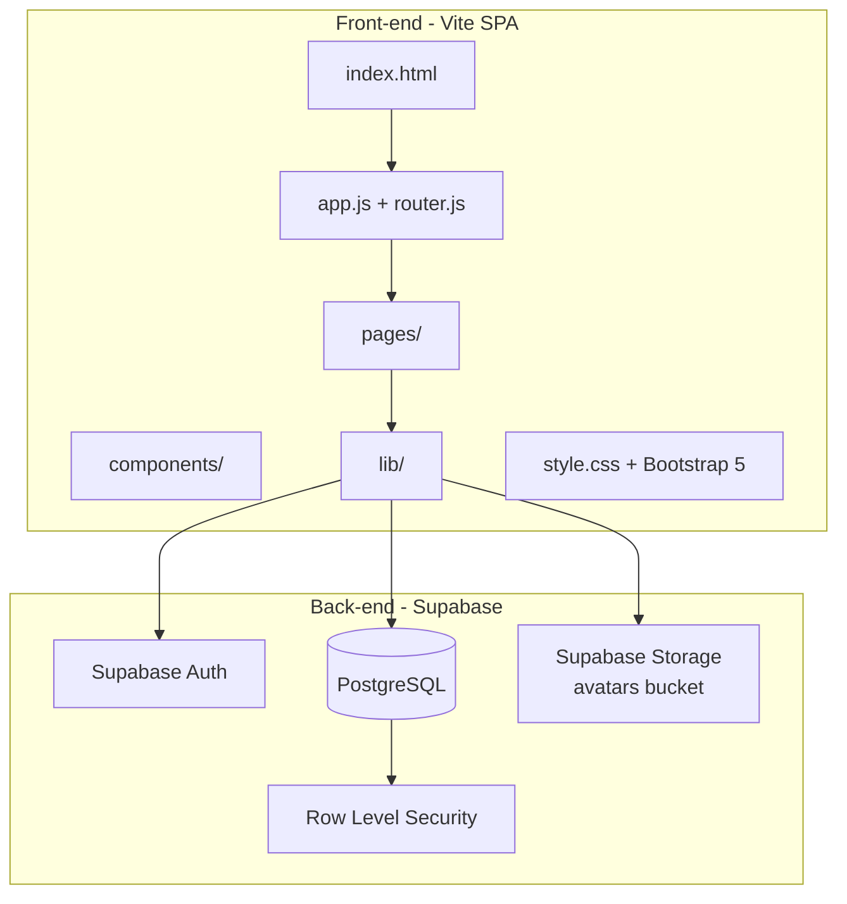
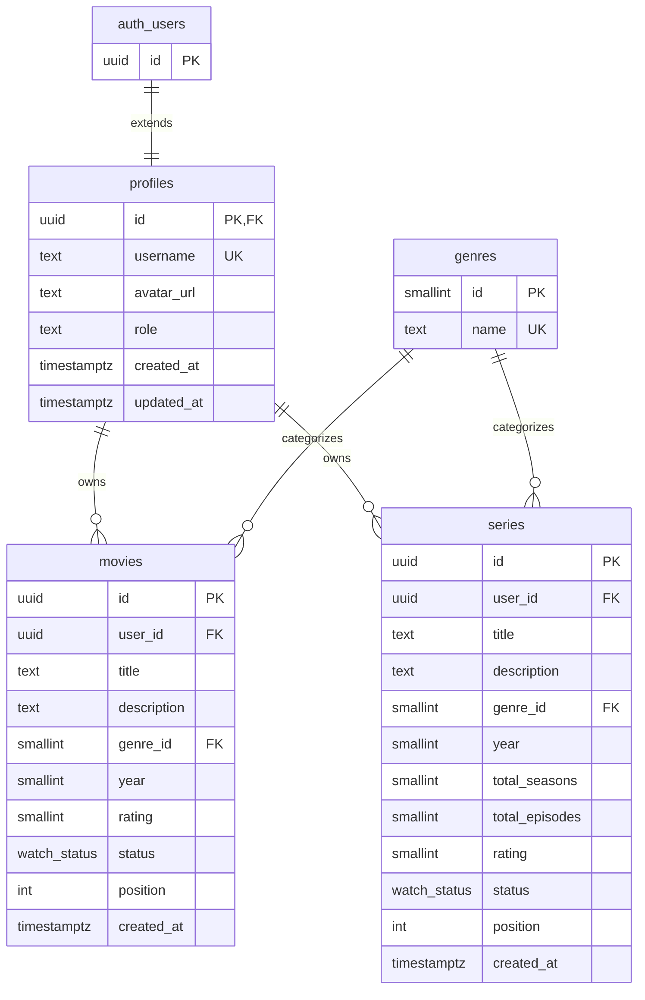

# Movie & Series Watchlist

A personal watchlist app for tracking movies and TV series. Users can organize titles on a Trello-style board with drag-and-drop, split across **Want to Watch** and **Watched** columns.

Inspired by [Letterboxd](https://letterboxd.com), the UI uses a dark theme with amber accents and responsive Bootstrap layouts.

---

## Project Description

### What it does

- **Landing page** — Introduces the app with a "How it works" section and feature highlights. Logged-in users see a personalized welcome with live watchlist stats.
- **Authentication** — Register and log in with email and password (Supabase Auth).
- **Dashboard** — Shows watchlist stats (total, want to watch, watched) for movies and series, plus export/import controls for your data.
- **Movies board** — Two-column kanban board to add, edit, delete, reorder, and drag movies between statuses. Filter by title or genre.
- **Series board** — Same board experience for TV series, including season and episode counts. Filter by title or genre.
- **Star ratings** — Rate any movie or series 1–5 stars from the add/edit form; ratings appear on cards and in the detail modal.
- **Profile page** — Edit your display name and profile photo. Upload a photo directly from your device (stored in Supabase Storage) or paste an external image URL.
- **Watchlist export / import** — Download your entire watchlist as a JSON file from the dashboard; restore it on another account or device by uploading the same file.
- **Admin panel** — View all users, promote/demote roles, delete accounts, and manage any user's movies or series.

### Who can do what

| Role | Capabilities |
|------|--------------|
| **Visitor (not signed in)** | View the landing page and login/register page |
| **Signed-in user** | View dashboard, manage their own movies and series, drag-and-drop to reorder and change status, edit their profile, export/import their watchlist |
| **Admin** | Everything a signed-in user can do, plus access `/admin` to view all users, promote/demote roles, delete users, and manage any user's movies or series |
| **Other users** | Cannot view or modify another user's watchlist (enforced by Row Level Security) |

Each user only sees and edits their own data. Genres are shared read-only lookup values available to everyone.

---

## Architecture



### Front-end

| Technology | Purpose |
|------------|---------|
| **HTML / CSS / JavaScript** | Core UI, no React/Vue framework |
| **Vite** | Dev server, bundling, and production builds |
| **Bootstrap 5** | Layout, forms, modals, toasts, responsive grid |
| **SortableJS** | Drag-and-drop on movie and series boards |

The app is a **single-page application (SPA)** with client-side routing. Pages render as HTML strings and bind event handlers after each navigation.

### Back-end

| Technology | Purpose |
|------------|---------|
| **Supabase** | Hosted backend (Auth + PostgreSQL + Storage + REST/JS client) |
| **PostgreSQL** | Relational database for profiles, movies, series, genres |
| **Row Level Security (RLS)** | Ensures users can only access their own watchlist rows |
| **Supabase Storage** | Hosts user profile photos (`avatars` bucket, public, 5 MB limit) |

There is no custom Node.js API server. The browser talks directly to Supabase using the **anon key**, with access controlled by RLS policies and the authenticated user's JWT.

### Database

- **Supabase Auth** (`auth.users`) stores credentials.
- **`profiles`** extends auth users with app-specific fields (username, avatar URL, role).
- **`movies`** and **`series`** store per-user watchlist items (title, description, genre, year, status, position, star rating).
- **`genres`** is a shared lookup table.
- **`avatars` Storage bucket** holds uploaded profile photos at `{user_id}/avatar.{ext}`.

Schema changes are versioned in `supabase/migrations/`.

---

## Database Schema Design

### Entity relationship diagram



### Enum: `watch_status`

| Value | Meaning |
|-------|---------|
| `want_to_watch` | On the user's watchlist |
| `watched` | Already watched |

### Profiles: `role` column

| Value | Meaning |
|-------|---------|
| `user` (default) | Normal signed-in account |
| `admin` | Full access to the admin panel |

### Key relationships

- **`profiles.id`** references **`auth.users.id`** — one profile per auth user.
- **`movies.user_id`** and **`series.user_id`** reference **`profiles.id`** — each row belongs to one user.
- **`genre_id`** on movies/series optionally references **`genres.id`**.
- **`position`** controls card order within a status column; updated via drag-and-drop.
- **`rating`** stores 1–5 star ratings; `NULL` means unrated.

### Security model

RLS policies on `movies` and `series` restrict `SELECT`, `INSERT`, `UPDATE`, and `DELETE` to rows where `auth.uid() = user_id`. Genres are readable by all authenticated users. Profiles are publicly readable; users can only insert/update their own profile.

Storage policies on the `avatars` bucket allow public `SELECT` (images are served via public URL) and per-user `INSERT` / `UPDATE` / `DELETE` scoped to the `{user_id}/` folder path.

A database trigger (`handle_new_user`) automatically creates a profile when a new user registers.

---

## Local Development Setup

### Prerequisites

- [Node.js](https://nodejs.org/) (v18+ recommended)
- [npm](https://www.npmjs.com/)
- A [Supabase](https://supabase.com) project

### 1. Clone the repository

```bash
git clone <your-repo-url>
cd movie-watchlist
```

### 2. Install dependencies

```bash
npm install
```

### 3. Configure environment variables

Copy the example env file and fill in your Supabase credentials:

```bash
cp .env.example .env
```

| Variable | Used by | Description |
|----------|---------|-------------|
| `VITE_SUPABASE_URL` | Front-end | Supabase project URL |
| `VITE_SUPABASE_ANON_KEY` | Front-end | Public anon key (safe for browser) |
| `SUPABASE_URL` | Seed script | Same project URL |
| `SUPABASE_SERVICE_ROLE_KEY` | Seed script | Service role key (**server-side only**) |

Find URL and keys in the Supabase dashboard under **Project Settings → API**.

### 4. Apply database migrations

Run the SQL files in `supabase/migrations/` against your Supabase project, in filename order:

1. `20260709180000_initial_watchlist_schema.sql`
2. `20260709180100_fix_function_security.sql`
3. `20260709190000_remove_poster_url.sql`
4. `20260711094700_add_series_table.sql`
5. `20260711110000_add_series_total_episodes.sql`
6. `20260711123500_add_user_roles.sql`
7. `20260712000000_add_rating_column.sql`
8. `20260713120000_add_avatars_storage_bucket.sql`

You can paste them into the Supabase SQL Editor or use the Supabase CLI if configured locally.

### 4b. Bootstrap the first admin (one-time)

After registering your account, promote it to admin in the Supabase SQL Editor:

```sql
UPDATE public.profiles
SET role = 'admin'
WHERE id = (
  SELECT id FROM auth.users WHERE email = 'your-email@example.com'
);
```

Replace `your-email@example.com` with the email you used to register. Only existing admins can promote other users from the `/admin` panel afterward.

### 4c. Deploy the admin delete-user Edge Function

The `/admin` panel deletes auth accounts via the `admin-delete-user` Edge Function. Deploy it from the project root with the Supabase CLI:

```bash
supabase functions deploy admin-delete-user
```

The function verifies the caller is an admin, then removes the user's profile, watchlist data, and auth account using the service role key (server-side only).

### 5. Configure Supabase Auth (recommended)

In **Authentication → Providers → Email**, disable **Confirm email** for easier local testing so users can sign in immediately after registration.

### 6. Start the dev server

```bash
npm run dev
```

Vite opens the app at `http://localhost:5173` by default.

### 7. Seed sample data (optional)

1. Register one or more users through the app (`/login`).
2. Run the seed script (requires the service role key in `.env`):

```bash
npm run seed
```

The script clears and repopulates movies and series for every existing profile with sample titles split across both statuses.

### Other scripts

| Command | Description |
|---------|-------------|
| `npm run build` | Production build to `dist/` |
| `npm run preview` | Preview the production build locally |

---

## Key Folders and Files

```
movie-watchlist/
├── index.html              # App entry HTML shell
├── vite.config.js          # Vite configuration (SPA mode)
├── package.json            # Dependencies and npm scripts
├── .env.example            # Environment variable template
│
├── src/
│   ├── main.js             # Bootstraps Bootstrap, styles, and initApp()
│   ├── app.js              # Route table, auth guards, page binding
│   ├── router.js           # Client-side History API router
│   ├── style.css           # Letterboxd-inspired theme and board styles
│   │
│   ├── pages/
│   │   ├── home.js         # Landing page (/) — personalised for logged-in users
│   │   ├── login.js        # Login / register (/login)
│   │   ├── dashboard.js    # Stats + export/import controls (/dashboard)
│   │   ├── movies.js       # Movies kanban board (/movies)
│   │   ├── series.js       # Series kanban board (/series)
│   │   ├── profile.js      # Profile editor — username, avatar (/profile)
│   │   ├── admin.js        # Admin panel (/admin)
│   │   └── movie.js        # Single movie detail route (/movies/:id/)
│   │
│   ├── components/
│   │   ├── layout.js       # App shell (header + main + footer)
│   │   ├── header.js       # Navbar with nav links and logout
│   │   ├── footer.js       # Site footer
│   │   └── toast.js        # Bootstrap toast notifications
│   │
│   └── lib/
│       ├── supabase.js     # Supabase client singleton
│       ├── auth.js         # Sign in, sign up, sign out, session + profile cache
│       ├── movies.js       # Movies CRUD, reorder, and stats API calls
│       ├── series.js       # Series CRUD, reorder, and stats API calls
│       ├── profile.js      # Profile update + avatar upload to Supabase Storage
│       ├── watchlist-io.js # Watchlist JSON export (download) and import (upload)
│       └── admin.js        # Admin-only user and content management
│
├── scripts/
│   └── seed.js             # Populates sample movies/series for all users
│
└── supabase/
    ├── functions/
    │   └── admin-delete-user/  # Edge Function: delete auth user (admin only)
    └── migrations/         # Versioned SQL schema migrations
```

### File responsibilities

| File | Purpose |
|------|---------|
| `src/app.js` | Defines routes, protects `/dashboard`, `/movies`, `/series`, `/profile`, and wires page-specific `bind*` functions after each render |
| `src/pages/home.js` | Landing page; shows live stats and quick-action links for signed-in users, "How it works" steps and feature grid for visitors |
| `src/pages/dashboard.js` | Renders watchlist stats and the export/import section; `bindDashboardPage` wires the export button and import file input |
| `src/pages/profile.js` | Profile editor with avatar file upload (fires immediately on pick), URL fallback, and username field |
| `src/pages/movies.js` | Renders the movies board, modals, SortableJS drag-and-drop, search/genre filter, and form handling |
| `src/pages/series.js` | Same board pattern for series (includes total seasons/episodes) |
| `src/lib/profile.js` | `uploadAvatar(file)` uploads to Supabase Storage and returns a public URL; `updateProfile()` writes username and avatar_url to the profiles table |
| `src/lib/watchlist-io.js` | `exportWatchlist()` fetches all movies + series and triggers a JSON download; `importWatchlist(json)` parses the file and inserts records |
| `src/lib/movies.js` | Supabase queries: list, create, update, delete, reorder, and stat aggregation for movies |
| `src/lib/series.js` | Supabase queries: list, create, update, delete, reorder, and stat aggregation for series |
| `src/lib/auth.js` | Wraps Supabase Auth, caches the active session and profile, exposes `refreshProfile()` |
| `src/components/toast.js` | Global success/error/warning toast helper used after CRUD and async actions |
| `scripts/seed.js` | Backend seed using the service role key; never import in front-end code |

---

## Routes

| Path | Access | Description |
|------|--------|-------------|
| `/` | Public | Landing page (personalised when signed in) |
| `/login` | Public (redirects if signed in) | Login and registration |
| `/dashboard` | Auth required | Watchlist statistics + data export/import |
| `/movies` | Auth required | Movies kanban board |
| `/series` | Auth required | Series kanban board |
| `/profile` | Auth required | Edit username and profile photo |
| `/admin` | Admin required | User and content management |
| `/movies/:id/` | Public | Movie detail page |

---

## Deployment

The app is designed for static hosting (e.g. **Netlify**):

- **Build command:** `npm run build`
- **Publish directory:** `dist`
- **Environment variables:** `VITE_SUPABASE_URL`, `VITE_SUPABASE_ANON_KEY`

---

## License

Private project — see repository settings for license details.
